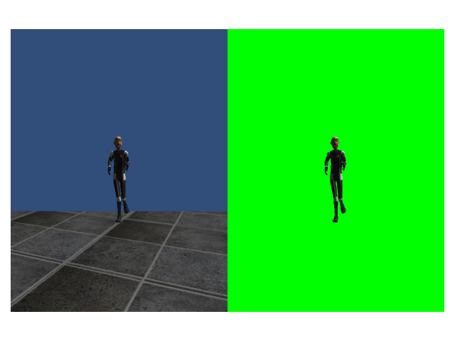

# CMPT 726 course project
## Work in progress
This project is not finished yet. More details will be added later.

## Overview
This repository includes the training part. For the data collection part, check out [this repository](https://github.com/chenjshihchieh/Unity-data-collection).

## Milestones
1. (Fall 2020) ...
2. ...

## How to run
To verify segmentation images:
- Put capture images to `./data/verify-seg/Captures/` and segmentation images to `./data/verify-seg/Segmentation/`;
- Run `verify_segmentation.py`.

Example result:

To train the model:
- ...