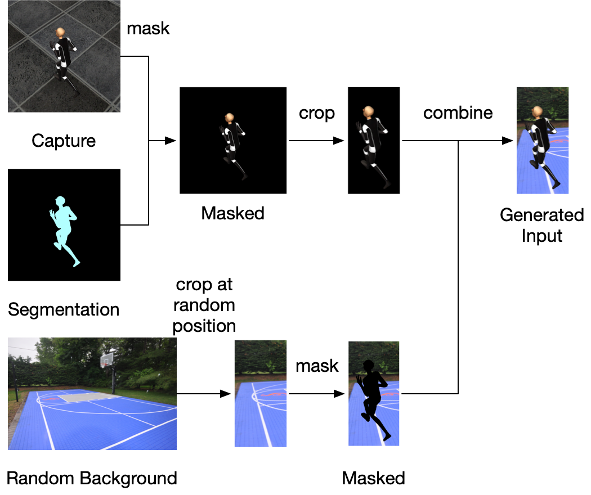
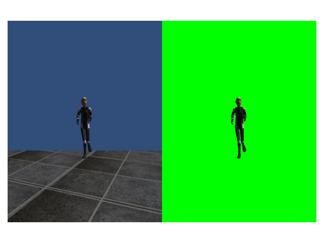

# CMPT 726 course project

## Overview

This repository includes the data generation and the training part. For the data collection part, check
out [this repository](https://github.com/chenjshihchieh/Unity-data-collection).

Before training our model, we need to generate images and labels based on the data we collected using Unity.

The diagram below illustrates the process of generating the images:

Each label is composed of (x, y) coordinates of the 21 keypoints after cropping the capture image (a total of 42
numbers), ultimately derived from annotation data captured in Unity.

## How to run

To verify segmentation images:

1. Put capture images to `./data/verify-seg/Captures/` and segmentation images to `./data/verify-seg/Segmentation/`;
2. Run `verify_segmentation.py`.

Example result:

How to generate images and labels for the model:

1. Put capture images to `./data/captures/`, segmentation images to `./data/segmentation/`, image JSON files
   to `./data/image-json/`, annotation JSON files to `./data/annotation-json/`, and background images
   to `./data/backgrounds/`.
2. Run `./generate_data.py`. Generated images and labels will be saved to `./data/generated/`.

To train the model:

1. Make sure you have generated input (images) and label (`.dat` files) data for the model: check the
   folder `./data/generated/` for images and `.dat` files.
2. Run `./train.py`. The state dictionary for trained models will be saved to `./model/`.

To visualize a trained model:

1. Make sure you have generated input (images) and label (`.dat` files) data for the model: check the
   folder `./data/generated/` for images and `.dat` files.
2. Set the value of `MODEL_FILE` to the model file you want to use.
3. Run `./visualize.py`. The predicted keypoints will be marked onto the input image along with the ground truth.
