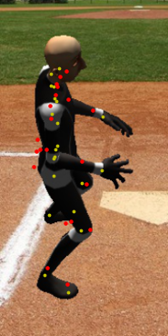

# CMPT 726 course project

## Overview

This repository includes the data generation and the training part. For the data collection part, check
out [this repository](https://github.com/chenjshihchieh/Unity-data-collection).

Before training our model, we need to generate images and labels based on the data we collected using Unity.

The diagram below illustrates the process of generating the images:


Each label is composed of (x, y) coordinates of the 21 keypoints after cropping the capture image (a total of 42
numbers), ultimately derived from annotation data captured in Unity.

## How to run

To verify segmentation images:

1. Put capture images to `./data/verify-seg/Captures/` and segmentation images to `./data/verify-seg/Segmentation/`;
2. Run `verify_segmentation.py`.

Example result:


How to generate images and labels for the model:

1. Put capture images to `./data/captures/`, segmentation images to `./data/segmentation/`, image JSON files
   to `./data/image-json/`, annotation JSON files to `./data/annotation-json/`, and background images
   to `./data/backgrounds/`.
2. Run `./generate_data.py`. Generated images and labels will be saved to `./data/generated/`.

Example result, generated image and keypoint coordinates excerpted from the corresponding `.dat` file:


```
144.337646484375 175.34860229492188 139.01473999023438 161.71273803710938 121.14251708984375 138.3570556640625 108.52351379394531 97.51309204101562 93.55744934082031 78.06307983398438 146.45822143554688 196.06893920898438 150.63327026367188 254.42599487304688 237.86849975585938 272.1484069824219 238.2984619140625 299.012451171875 143.72525024414062 168.48287963867188 93.70547485351562 229.15171813964844 115.41853332519531 283.83567810058594 83.12446594238281 286.8453826904297 108.13362121582031 112.98324584960938 110.00558471679688 130.53781127929688 142.36370849609375 177.38316345214844 82.56181335449219 159.21612548828125 109.21835327148438 98.7264404296875 113.514404296875 82.65817260742188 163.92178344726562 102.13677978515625 118.7830810546875 129.430908203125
```

To train the model:

1. Make sure you have generated input (images) and label (`.dat` files) data for the model: check the
   folder `./data/generated/` for images and `.dat` files.
2. Run `./train.py`. The state dictionary for trained models will be saved to `./model/`.

An example of the standard output can be found at `./doc/text/output.txt`.

To visualize a trained model:

1. Make sure you have generated input (images) and label (`.dat` files) data for the model: check the
   folder `./data/generated/` for images and `.dat` files.
2. Set the value of `MODEL_FILE` to the model file you want to use.
3. Run `./visualize.py`. The predicted keypoints will be marked onto the input image along with the ground truth.

Example result (red dots are predictions, yellow dots are the ground truth):

